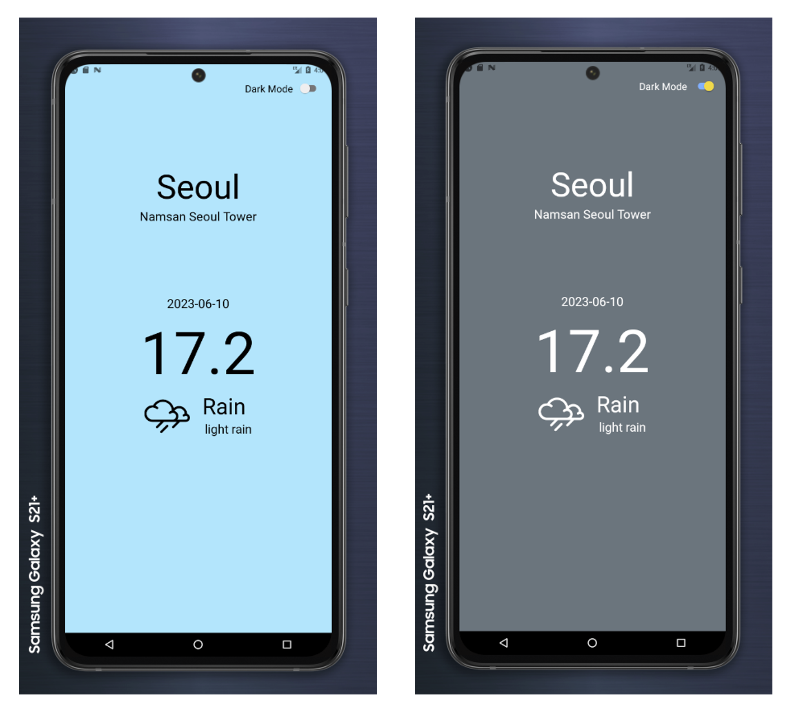

# RN-Tutorial-NomadWeather

React Native Tutorial for Nomad Weather

## Execution Sample

### Light Mode / Dark Mode

## Special Thanks

- [Nomad Coders](https://academy.nomadcoders.co/) for the tutorial.
- [OpenWeatherMap](https://openweathermap.org/) for the Weather API.
